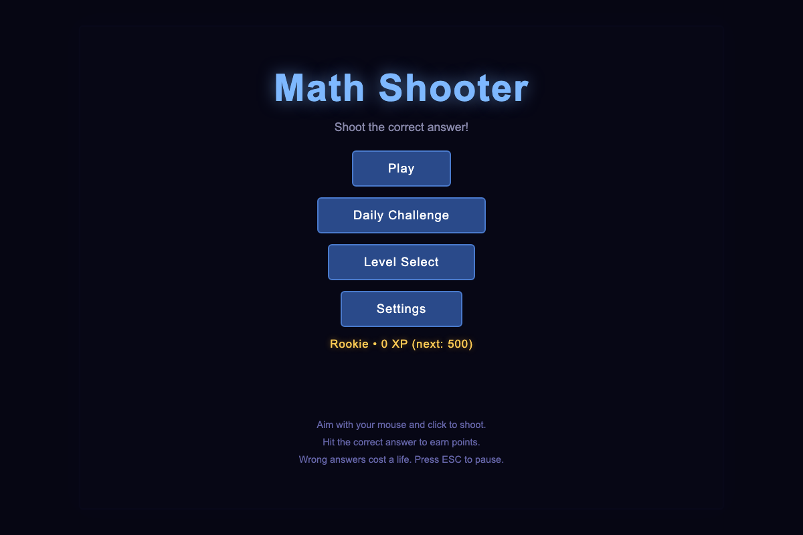
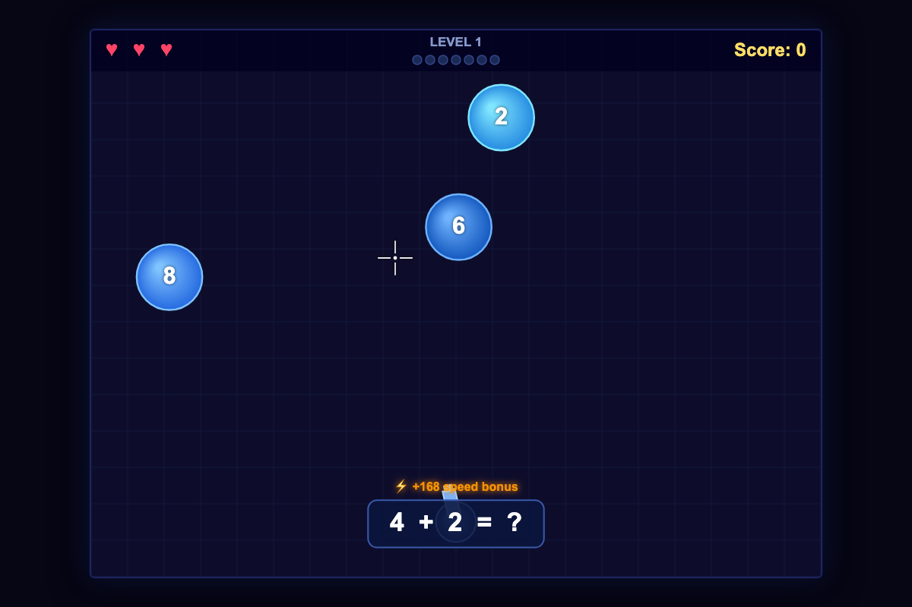
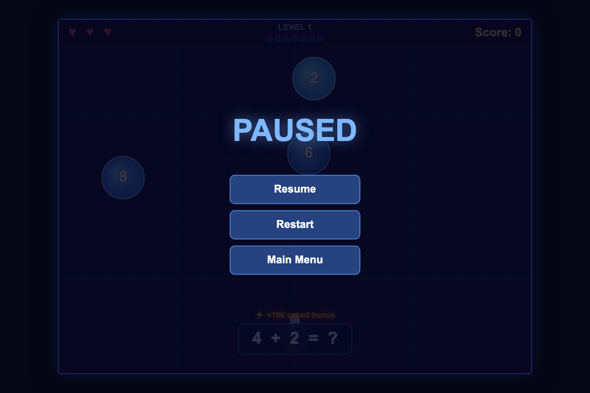
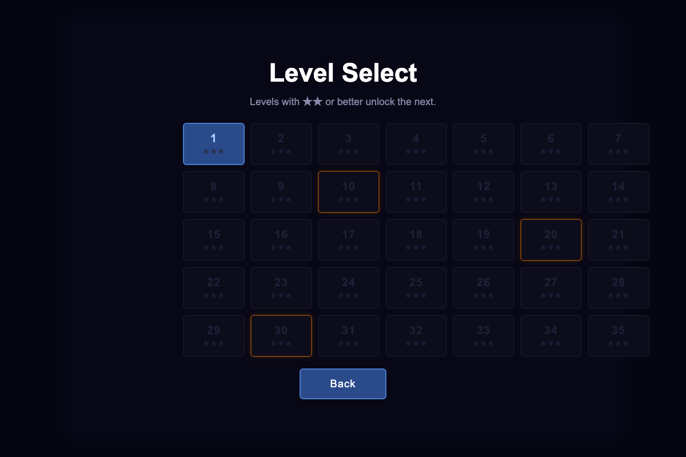
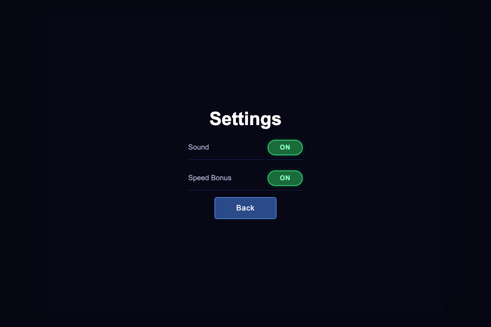

# Math Shooter

A fast-paced browser game where you shoot the correct answer to math questions. Bubbles float around the screen — aim your crosshair and click to fire. 35 levels with increasing difficulty, boss rounds, power-ups, and an endless mode.

No build step. No dependencies. Pure vanilla JS + HTML5 Canvas.

---

## Screenshots

### Main Menu


### Gameplay

*Speed bonus indicator rewards quick answers. Progress dots track your 7 questions per level.*

### Pause Menu


### Level Select

*35 levels. Orange borders mark boss rounds (10, 20, 30). Earn ★★ or better to unlock the next level.*

### Settings


---

## How to Play

- **Aim** with your mouse — a crosshair follows your cursor
- **Click** to shoot a bullet toward the target
- **Hit the correct answer** to the math question shown at the bottom
- Wrong answers cost a life (♥♥♥)
- Complete 7 questions to finish the level
- **Press ESC** to pause mid-game

---

## Scoring

| Action | Points |
|---|---|
| Correct answer | 100 base |
| Speed bonus | Up to +200 (fades as time passes) |
| Combo multiplier | ×2 at 3-streak, ×3 at 6, etc. |
| Defuse a bomb | +150 |

Answer faster to earn more. The ⚡ speed bonus indicator shows how much bonus is on the table right now.

### Stars & XP
Each level awards 1–3 stars based on wrong answers:
- ★★★ — zero mistakes
- ★★ — 1–2 mistakes
- ★ — 3 or more mistakes

Stars gate level progression (★★ minimum to unlock the next). XP is earned every level and goes toward your rank: **Rookie → Cadet → Soldier → Veteran → Expert → Ace → Math God**.

---

## Level Progression

| Levels | Operators | Notes |
|---|---|---|
| 1–10 | Addition `+` | Speed increases each level |
| 10 | Boss | Correct bubble is giant, decoys are tiny. Orange HP bar. |
| 11–20 | Subtraction `−`, mixed `+/−` | Bubble sizes start varying |
| 20 | Boss | Mixed operators, tighter timer |
| 21–27 | Multiplication `×`, all three ops | Faster movement, more bubbles |
| 28–35 | Division `÷`, all four ops | Max chaos — size varies 0.65×–1.42× |
| 30 | Boss | All four operators |
| 36+ | **Endless** | Extrapolates from level 35, grows harder forever |

---

## Power-ups

Power-ups float across the screen and despawn after 9 seconds. Shoot them to collect.

| Icon | Name | Effect |
|---|---|---|
| ❄ | **Freeze** | All bubbles freeze in place for 4 seconds |
| ⚡ | **Multishot** | Fire 3 bullets in a spread for 8 seconds |
| 🛡 | **Shield** | Absorbs one wrong answer (no life lost) |

---

## Bombs

💣 Bombs appear every 30–45 seconds with a 5-second fuse. The countdown is shown next to the bomb. **Shoot it to defuse** (+150 points). Ignore it and lose a life when it explodes.

---

## Modes

### Normal
Start from level 1, progress through all 35 levels. Unlock the win screen by clearing level 35.

### Daily Challenge
One run per day. Your best score for the day is saved and shown on the main menu. You can replay but only the top score counts.

### Endless
Unlocked from the win screen. Continues past level 35 with escalating difficulty — faster bubbles, smaller decoys, tighter time limits. No finish line.

---

## Controls

| Input | Action |
|---|---|
| Mouse move | Aim crosshair |
| Left click | Shoot |
| ESC | Pause / Resume |

---

## Ricochet Shots

Bullets bounce off the top wall and side walls up to **2 times** before disappearing. Use this to reach bubbles behind obstacles or to make trick shots.

---

## Running Locally

```bash
node server.js
```

Then open http://localhost:8765.

Requires Node.js 18+. No npm install needed — the server uses only built-in Node modules.

---

## Project Structure

```
math-shooter/
├── index.html
├── style.css
├── js/
│   ├── main.js
│   ├── core/
│   │   ├── Game.js              — screen management, mode orchestration
│   │   ├── GameLoop.js          — fixed-timestep rAF loop
│   │   ├── InputManager.js      — mouse + keyboard queue
│   │   ├── EventBus.js          — pub/sub decoupling
│   │   ├── AudioManager.js      — Web Audio API synthesized sounds
│   │   ├── Settings.js          — localStorage-backed settings
│   │   └── Progress.js          — XP, stars, highscore, daily score
│   ├── entities/
│   │   ├── Target.js            — floating bubble with size scaling
│   │   ├── Bullet.js            — ricochet + trail rendering
│   │   ├── Player.js            — cannon turret at the bottom
│   │   ├── PowerUp.js           — freeze / multishot / shield pickups
│   │   └── EnemyProjectile.js   — cosmetic counter-attack on wrong hit
│   ├── systems/
│   │   ├── BulletPool.js        — object pool (30 bullets), multishot spread
│   │   ├── ParticleSystem.js    — burst particles on correct hit
│   │   └── CollisionSystem.js   — bullet↔target hit detection
│   ├── math/
│   │   ├── DifficultyConfig.js  — 35 level definitions + endless extrapolation
│   │   └── QuestionFactory.js   — question generation, decoy values
│   ├── renderer/
│   │   └── HUD.js               — lives, score, timer bar, boss HP bar, effects
│   └── screens/
│       └── GameScreen.js        — main game loop screen, all gameplay logic
└── screenshots/
```
